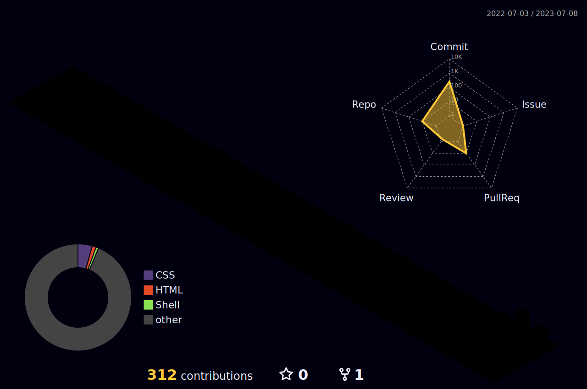

<h1 align="center">
  
  𝐇𝐞𝐥𝐥𝐨, &lt;𝚌𝚘𝚍𝚎𝚛𝚜/&gt;!
  
</h1>

<br/>
<br/>


- 🔭 𝙸’𝚖 𝚌𝚞𝚛𝚛𝚎𝚗𝚝𝚕𝚢 𝚠𝚘𝚛𝚔𝚒𝚗𝚐 𝚘𝚗 **Spring Boot 𝚊𝚗𝚍 𝚆𝚎𝚋 𝙳𝚎𝚟𝚎𝚕𝚘𝚙𝚖𝚎𝚗𝚝.**
- 🌱 𝙸’𝚖 𝚌𝚞𝚛𝚛𝚎𝚗𝚝𝚕𝚢 𝚕𝚎𝚊𝚛𝚗𝚒𝚗𝚐 **𝙳𝚎𝚟𝙾𝚙𝚜 𝚊𝚗𝚍 𝙲𝚘𝚖𝚙𝚎𝚝𝚒𝚝𝚒𝚟𝚎 𝙿𝚛𝚘𝚐𝚛𝚊𝚖𝚖𝚒𝚗𝚐.**
- 👯 𝙸’𝚖 𝚕𝚘𝚘𝚔𝚒𝚗𝚐 𝚝𝚘 𝚌𝚘𝚕𝚕𝚊𝚋𝚘𝚛𝚊𝚝𝚎 𝚘𝚗 **𝙰𝚗𝚍𝚛𝚘𝚒𝚍, 𝙳𝚊𝚝𝚊 𝚂𝚌𝚒𝚎𝚗𝚌𝚎 𝚘𝚛 𝚆𝚎𝚋 𝙳𝚎𝚟𝚎𝚕𝚘𝚙𝚖𝚎𝚗𝚝.**
- 💬 𝙰𝚜𝚔 𝙼𝚎 𝙰𝚋𝚘𝚞𝚝 𝙰𝚗𝚢𝚝𝚑𝚒𝚗𝚐 [here](https://www.instagram.com/_wolvfyxmoon_ornery/) ! 𝙸 𝚊𝚖 𝚑𝚊𝚙𝚙𝚢 𝚝𝚘 𝚑𝚎𝚕𝚙.
- 😄 𝙿𝚛𝚘𝚗𝚘𝚞𝚗𝚜 : **𝙷𝚎/𝙷𝚒𝚖/𝙷𝚒𝚜.**
- ⚡ 𝙵𝚞𝚗 𝚏𝚊𝚌𝚝 : **𝙱𝚎𝚜𝚝 𝙿𝚊𝚛𝚝 𝙾𝚏 𝚃𝚑𝚎 𝙹𝚘𝚞𝚛𝚗𝚎𝚢 𝙸𝚜 : *𝙸𝚝 𝙴𝚗𝚍𝚜.***

<br/>
<br/>


<p align="center"> 
   •
   •
</p>
<!-- <p align="center">
  <code>
    
  </code>
</p> -->

#
<p align="center"> 


<p align="center">
  
  
  
</p>

#


<br/>

**𝙻𝙰𝙽𝙶𝚄𝙰𝙶𝙴𝚂 𝙰𝙽𝙳 𝚃𝙾𝙾𝙻𝚂:**  

<br/>
<br/>


<code></code>
<code></code>
<code></code>
<code></code>
<code></code>
<code></code>
<code></code>
<code></code>
<code></code>

#

<code></code>
<code></code>
<code></code>
<code></code>
<code></code>
<code></code>
<code></code>
<code></code>
<code></code>


<br/>

#

<details open="">
<summary>
  <g-emoji class="g-emoji" alias="chart_with_upwards_trend" fallback-src="https://github.githubassets.com/images/icons/emoji/unicode/1f4c8.png">📈</g-emoji>
  <strong>𝙶𝚒𝚝𝚑𝚞𝚋 𝚂𝚝𝚊𝚝𝚜 : </strong>
</summary>
<br/>

<p align="center">
    
    
</p>
</details>
<br/>




<h4 align="center">
  
```diff
+@ @ @ @ @ @ @ @ @ @ @ @ @ @ @ @ @ @ @ @ @ @ @ @ @ @ @ @+
@@       o o                                           @@
@@       | |                                           @@
@@      _L_L_                                          @@
@@   ❮\/__-__\/❯ Programming isn't about what you know @@
@@   ❮(|~o.o~|)❯  It's about what you can figure out   @@
@@   ❮/ \`-'/ \❯                                       @@
@@     _/`U'\_                                         @@
@@    ( .   . )     .----------------------------.     @@
@@   / /     \ \    | while( ! (succeed=try() ) ) |     @@
@@   \ |  ,  | /    '----------------------------'     @@
@@    \|=====|/                                        @@
@@     |_.^._|                                         @@
@@     | |"| |                                         @@
@@     ( ) ( )   Testing leads to failure              @@
@@     |_| |_|   and failure leads to understanding    @@
@@ _.-' _j L_ '-._                                     @@
@@(___.'     '.___)                                    @@
+@ @ @ @ @ @ @ @ @ @ @ @ @ @ @ @ @ @ @ @ @ @ @ @ @ @ @ @+
```

</h4>  
  


<br/>

#

<summary>
  <g-emoji class="g-emoji" alias="chart_with_upwards_trend" fallback-src="https://github.githubassets.com/images/icons/emoji/unicode/1f4c8.png">📈</g-emoji>
  <strong>𝚆𝚊𝚔𝚊𝚃𝚒𝚖𝚎 𝚂𝚝𝚊𝚝𝚜 : </strong>
</summary>


<br>
<br>

<!--START_SECTION:waka-->


**🐱 My GitHub Data** 

> 📦 122.5 kB Used in GitHub's Storage 
 > 
> 🏆 1,450 Contributions in the Year 2023
 > 
> 💼 Opted to Hire
 > 
> 📜 12 Public Repositories 
 > 
> 🔑 5 Private Repositories 
 > 
**I'm a Night 🦉** 

```text
🌞 Morning                252 commits         ███░░░░░░░░░░░░░░░░░░░░░░   10.43 % 
🌆 Daytime                418 commits         ████░░░░░░░░░░░░░░░░░░░░░   17.29 % 
🌃 Evening                1356 commits        ██████████████░░░░░░░░░░░   56.10 % 
🌙 Night                  391 commits         ████░░░░░░░░░░░░░░░░░░░░░   16.18 % 
```
📅 **I'm Most Productive on Sunday** 

```text
Monday                   163 commits         ██░░░░░░░░░░░░░░░░░░░░░░░   06.74 % 
Tuesday                  161 commits         ██░░░░░░░░░░░░░░░░░░░░░░░   06.66 % 
Wednesday                200 commits         ██░░░░░░░░░░░░░░░░░░░░░░░   08.27 % 
Thursday                 237 commits         ██░░░░░░░░░░░░░░░░░░░░░░░   09.81 % 
Friday                   246 commits         ███░░░░░░░░░░░░░░░░░░░░░░   10.18 % 
Saturday                 245 commits         ███░░░░░░░░░░░░░░░░░░░░░░   10.14 % 
Sunday                   1165 commits        ████████████░░░░░░░░░░░░░   48.20 % 
```


📊 **This Week I Spent My Time On** 

```text
🕑︎ Time Zone: Asia/Kolkata

💬 Programming Languages: 
JavaScript               19 mins             ██████████████░░░░░░░░░░░   56.64 % 
Text                     3 mins              ███░░░░░░░░░░░░░░░░░░░░░░   10.94 % 
HTML                     2 mins              ██░░░░░░░░░░░░░░░░░░░░░░░   08.40 % 
Bash                     2 mins              ██░░░░░░░░░░░░░░░░░░░░░░░   08.35 % 
XML                      2 mins              ██░░░░░░░░░░░░░░░░░░░░░░░   07.18 % 

🔥 Editors: 
VS Code                  34 mins             █████████████████████████   100.00 % 

🐱‍💻 Projects: 
react-portfolio-final    29 mins             █████████████████████░░░░   84.56 % 
TheFatRat                2 mins              ██░░░░░░░░░░░░░░░░░░░░░░░   08.35 % 
Next.js-Developer-Portfol2 mins              ██░░░░░░░░░░░░░░░░░░░░░░░   07.10 % 

💻 Operating System: 
Linux                    34 mins             █████████████████████████   100.00 % 
```

**I Mostly Code in Shell** 

```text
Shell                    3 repos             ████████░░░░░░░░░░░░░░░░░   30.00 % 
JavaScript               2 repos             █████░░░░░░░░░░░░░░░░░░░░   20.00 % 
HTML                     2 repos             █████░░░░░░░░░░░░░░░░░░░░   20.00 % 
CSS                      2 repos             █████░░░░░░░░░░░░░░░░░░░░   20.00 % 
TypeScript               1 repo              ██░░░░░░░░░░░░░░░░░░░░░░░   10.00 % 
```


**Timeline**


 Last Updated on 23/07/2023 02:04:16 UTC
<!--END_SECTION:waka-->

<p align="center">
  
  
</p>

#

<p align="center">
    
  <h4 align="center"><code>📊 𝙶𝚒𝚝𝙷𝚞𝚋 𝙼𝚎𝚝𝚛𝚒𝚌𝚜</code></h4>
</p>

<p align="center">
  
  
</p>

<div align="center">
  <a href="https://app.daily.dev/wolvfyxmoonornery">
     
  </a>
</div>

<h1>
  Connect With Me
  
</h1>

<p align="center">
  <br>
  <a href="https://www.linkedin.com/in/wolvfyxmoon-ornery/" target="_blank">
    <code></code>
  </a>
  <a href="https://www.facebook.com/wolvyxmoon-ornery/" target="_blank">
    <code></code>
  </a>
  <a href="https://www.instagram.com/_wolvfyxmoon_ornery//" target="_blank">
    <code></code>
  </a>
  <a href="https://twitter.com/MukulSh33946252" target="_blank">
    <code></code>
  </a>
  <a href="https://dev.to/wolvfyxmoon-ornery">
    <code></code>
  </a>     
</p>
<br/>

<br/>
<br/>

<div align="center">

### 𝚂𝚑𝚘𝚠 𝚜𝚘𝚖𝚎 ❤️ 𝚋𝚢 𝚜𝚝𝚊𝚛𝚛𝚒𝚗𝚐 𝚜𝚘𝚖𝚎 𝚘𝚏 𝚝𝚑𝚎 𝚛𝚎𝚙𝚘𝚜𝚒𝚝𝚘𝚛𝚒𝚎𝚜!

</div>

#


